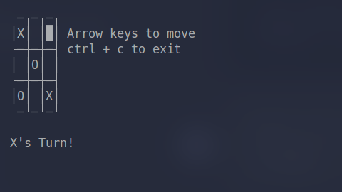

<div align="center">
    <h1>TTTXO</h1>
</div>

<div align="center">
    
</div>

<div align="center">
    A simple game of noughts and crosses
</div>

<div align="center">
    <br/>
    
    
</div>

## Install

```
pip install git+https://github.com/WizzyGeek/tttxo
```

## Playing

> Requires another person, playing alone with an algorithm you can't beat is no fun :(
```
tttxo
```
#### Disclaimer
Windows has no curses, so no keyboard input, but still playable

<div align="center">
    <h1></h1>
    <h6>© WizzyGeek 2023</h6>
</div>